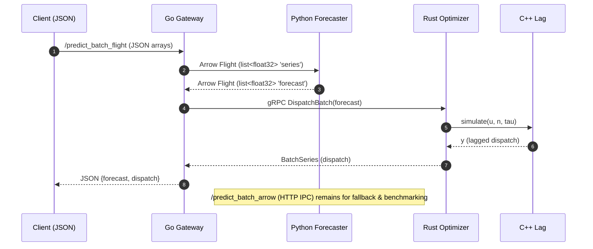

# Ener-gentic /mesh — AI + Energy Mesh (V3.2 + V3.5 cadence-ready)

[](https://www.docker.com/)
[](https://grpc.io/)
[](https://arrow.apache.org/)

**Python → Rust(+C++) → Go** with Arrow on the wire. One proto, clean seams.  
**Flight native** in Gateway with graceful fallback to Arrow-HTTP.  
**Cadence switch**: minutes (60) or seconds (3600) horizons via `CADENCE` env.

## Quickstart
```bash
docker compose build && docker compose up

# JSON single
curl -s -X POST localhost:8080/predict   -H 'Content-Type: application/json'   -d '{"x":[4,5,6,7,6,5,5,6,8,7,6,6,7,7,6,5,5,6,7,8]}' | jq .

# Batch via Flight (preferred)
curl -s -X POST localhost:8080/predict_batch_flight   -H 'Content-Type: application/json'   -d '{"x":[[4,5,6,7,6,5,6,7,8,7],[3,4.8,7.2,2.1,5.5,6.0,7.8,6.3,5.1,4.9]]}' | jq .

# Batch via Arrow-HTTP (baseline)
curl -s -X POST localhost:8080/predict_batch_arrow   -H 'Content-Type: application/json'   -d '{"x":[[4,5,6,7,6,5,6,7,8,7],[3,4.8,7.2,2.1,5.5,6.0,7.8,6.3,5.1,4.9]]}' | jq .
```

## Cadence
Set `CADENCE=seconds` on `forecaster` to switch to 3600-step forecasts (micro-gusts injected).

## Architecture


## Stack & Tweak
| Component | Role | Tech | Tweak |
|---|---|---|---|
| Python Forecaster | 60/3600 forecasts | NumPy, gRPC, Flask, PyArrow, Flight | `CADENCE`, gusts, Torch swap |
| Rust Optimizer | Clamp/ramp setpoints | tonic gRPC | limits, ramp, MPC terms |
| C++ Sim | Inverter lag + 0.1% jitter | C ABI | tune `tau`, noise |
| Go Gateway | HTTP + Flight client | net/http, grpc-go, Arrow Go | chunk size, retries |

`proto/core.proto` is the contract. Regenerate stubs in Docker; no drift.
